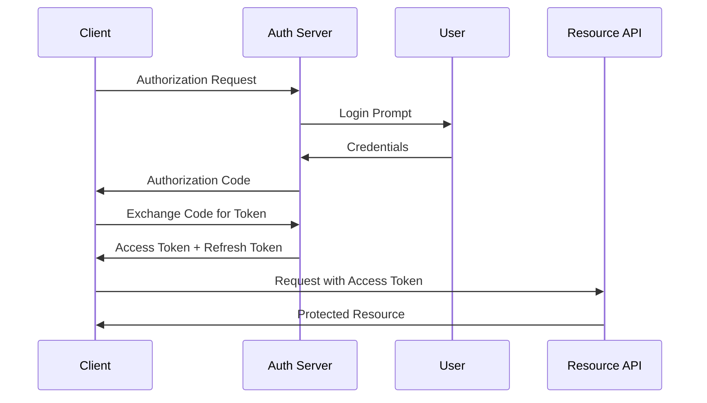

Building enterprise-grade web applications requires careful planning across multiple dimensions: architecture, performance, security, and maintainability. This guide consolidates my experience building applications for banking, healthcare, and enterprise clients.

## Architecture Decisions

### Monoliths vs Microservices

The first decision you'll face is architectural. For most projects, start with a well-structured monolith:

- **When to choose monolith**: Early-stage products, small-to-medium teams, simpler domain logic
- **When to choose microservices**: Multiple teams, independent deployment needs, complex domains

> "A modular monolith gives you 80% of microservices benefits with 20% of the complexity." — Anonymous Senior Dev

### Layered Architecture Pattern

A clean layered architecture separates concerns:

```
┌─────────────────────────┐
│     Presentation        │  ← Controllers, Views, API Resources
├─────────────────────────┤
│     Application         │  ← Use Cases, DTOs, Service Layer
├─────────────────────────┤
│     Domain              │  ← Entities, Value Objects, Business Rules
├─────────────────────────┤
│     Infrastructure      │  ← Database, External APIs, File Storage
└─────────────────────────┘
```

Each layer only depends on the layer directly below it.

## Database Design Principles

### Choosing the Right Database

| Database | Best For | Avoid When |
|---|---|---|
| PostgreSQL | Complex queries, JSON, GIS | Simple key-value needs |
| MySQL | Read-heavy apps, simple relations | Complex analytical queries |
| MongoDB | Flexible schemas, rapid prototyping | Complex transactions |
| Redis | Caching, sessions, real-time | Primary data store (without persistence) |

### Indexing Strategy

Proper indexing can improve query performance by 1000x:

```sql
-- Bad: Full table scan
SELECT * FROM orders WHERE user_id = 123;

-- Good: Uses index
CREATE INDEX idx_orders_user_id ON orders(user_id);
SELECT * FROM orders WHERE user_id = 123;
```

Key indexing rules:
1. Index columns used in `WHERE`, `JOIN`, and `ORDER BY`
2. Use composite indexes for multi-column queries
3. Avoid over-indexing — each index slows writes
4. Monitor with `EXPLAIN ANALYZE`

## API Design Best Practices

### RESTful Conventions

Follow consistent naming and structure:

```
GET     /api/v1/projects          # List projects
POST    /api/v1/projects          # Create project
GET     /api/v1/projects/:id      # Get project
PUT     /api/v1/projects/:id      # Update project
DELETE  /api/v1/projects/:id      # Delete project
```

### Versioning Strategy

API versioning prevents breaking changes:

- **URL versioning**: `/api/v1/projects`, `/api/v2/projects`
- **Header versioning**: `Accept: application/vnd.api+json;version=2`
- **Query parameter**: `/api/projects?version=2`

URL versioning is simplest and most widely adopted.

### Error Response Format

Standardize error responses:

```json
{
  "success": false,
  "error": {
    "code": "VALIDATION_ERROR",
    "message": "The given data was invalid",
    "details": [
      {
        "field": "email",
        "message": "The email field is required"
      }
    ]
  }
}
```

## Authentication & Authorization

### JWT vs Sessions

| Aspect | JWT | Sessions |
|---|---|---|
| Scalability | Stateless, great for microservices | Requires shared session store |
| Security | Vulnerable to XSS if stored in localStorage | HttpOnly cookies are safer |
| Mobile support | Excellent, no cookies needed | Cookie-dependent |
| Revocation | Complex (need blacklist) | Simple (delete session) |

### OAuth 2.0 Flow

For third-party integrations, OAuth 2.0 is the standard:



## Performance Optimization

### Caching Layers

Implement caching at multiple levels:

1. **Browser cache**: Static assets with long TTL
2. **CDN cache**: Edge-cached pages and assets
3. **Application cache**: Redis/Memcached for query results
4. **Database cache**: Query cache, connection pooling

### Background Jobs

Offload heavy processing to background queues:

```php
// Instead of this (slow synchronous):
public function exportReport(Request $request) {
    $data = $this->generateLargeReport(); // 30 seconds
    return response()->download($data);
}

// Do this (fast async):
public function exportReport(Request $request) {
    ExportReportJob::dispatch($request->user());
    return response()->json(['message' => 'Report being generated']);
}
```

### Database Query Optimization

Common optimization techniques:

- **Eager loading**: Prevent N+1 queries
- **Query caching**: Cache frequently accessed data
- **Connection pooling**: Reuse database connections
- **Read replicas**: Separate read/write workloads

```php
// N+1 Problem: 1 query for posts + N queries for authors
$posts = Post::all();
foreach ($posts as $post) {
    echo $post->author->name; // Extra query each loop
}

// Eager Loading: 2 queries total
$posts = Post::with('author')->get();
```

## Testing Strategy

### The Testing Pyramid

```
      ╱  E2E  ╲       ← Few slow tests
     ╱ Integration ╲
    ╱   Unit Tests   ╲  ← Many fast tests
   ───────────────────
```

- **Unit tests**: Test individual functions/classes in isolation
- **Integration tests**: Test how components work together
- **E2E tests**: Test complete user flows

### Test Coverage Goals

| Layer | Coverage Target | Focus |
|---|---|---|
| Domain logic | 90%+ | Business rules, entities |
| Service layer | 80%+ | Use cases, workflows |
| Controllers | 60%+ | Request/response handling |
| Infrastructure | 50%+ | External integrations |

## Security Essentials

### OWASP Top 10 Mitigations

1. **Injection**: Use parameterized queries, ORM
2. **Broken Authentication**: Multi-factor, rate limiting
3. **Sensitive Data Exposure**: Encrypt at rest and in transit
4. **XML External Entities**: Disable XXE in parsers
5. **Broken Access Control**: Principle of least privilege
6. **Security Misconfiguration**: Regular audits, secure defaults
7. **Cross-Site Scripting**: Output encoding, CSP headers
8. **Insecure Deserialization**: Validate before deserializing
9. **Using Vulnerable Components**: Regular dependency scanning
10. **Insufficient Logging**: Comprehensive audit trails

### Environment Security

Never commit secrets to version control:

```bash
# .env file (never committed)
DB_PASSWORD=super_secret_123
API_KEY=sk_live_abc123

# Access in code
$dbPassword = env('DB_PASSWORD');
```

## Deployment & DevOps

### CI/CD Pipeline

A robust pipeline ensures quality:

```
┌──────┐    ┌──────┐    ┌──────┐    ┌──────┐    ┌──────┐
│ Lint │ →  │ Test │ →  │Build │ →  │Stage │ →  │ Prod │
└──────┘    └──────┘    └──────┘    └──────┘    └──────┘
```

### Containerization with Docker

```dockerfile
FROM php:8.3-fpm-alpine

RUN docker-php-ext-install pdo pdo_mysql

COPY --from=composer:latest /usr/bin/composer /usr/bin/composer

WORKDIR /var/www
COPY . .

RUN composer install --no-dev --optimize-autoloader

EXPOSE 9000
CMD ["php-fpm"]
```

## Monitoring & Observability

### Key Metrics to Track

| Category | Metrics | Tools |
|---|---|---|
| Application | Response time, error rate, throughput | New Relic, Datadog |
| Infrastructure | CPU, memory, disk, network | Prometheus, Grafana |
| Business | Conversion rate, user retention | Amplitude, Mixpanel |
| Security | Failed logins, suspicious activity | ELK Stack, Splunk |

### Logging Best Practices

Structure your logs for easy querying:

```json
{
  "timestamp": "2025-12-20T10:30:00Z",
  "level": "ERROR",
  "service": "payment-service",
  "trace_id": "abc-123-def",
  "message": "Payment processing failed",
  "context": {
    "order_id": "ORD-456",
    "amount": 150000,
    "error": "Insufficient funds"
  }
}
```

## Conclusion

Building enterprise-grade applications requires attention to architecture, performance, security, and maintainability. The most important principle is to make deliberate choices — every layer, every pattern, every tool should serve a clear purpose. Start simple, measure constantly, and optimize based on real data.

---

*This guide is based on my experience building applications for banking, healthcare, and enterprise clients at PT Inmotion Inovasi Teknologi and PT BTPN Syariah Tbk.*
